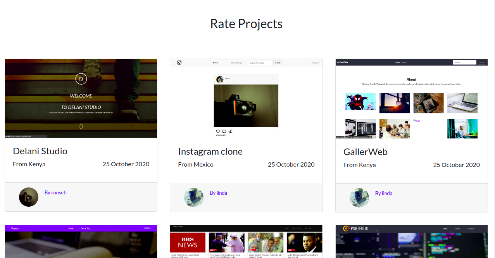
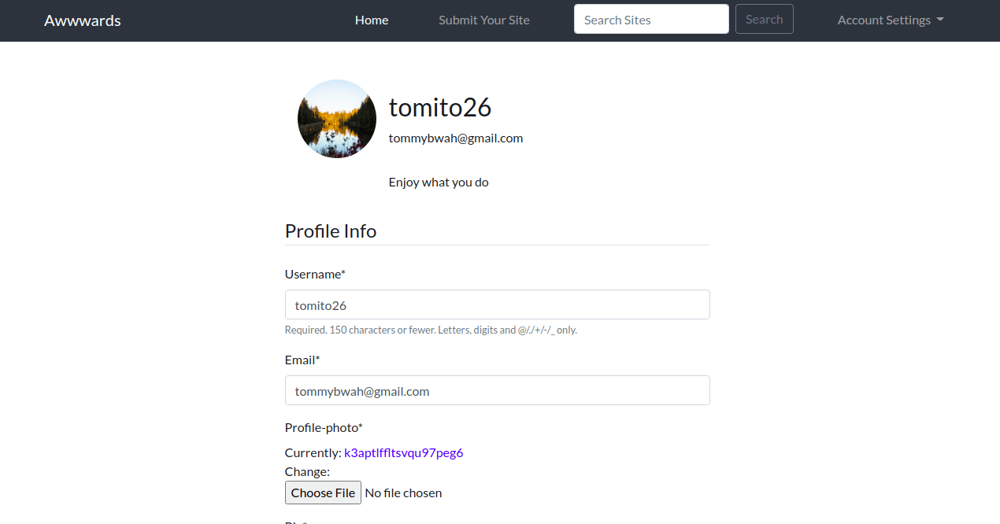

# Awwwards App
This  project is a [Awwwards](https://awwwards26.herokuapp.com/) clone website where users can  post their websites and it gets rated by other users,they also can rate other users' websites

Here is the landing page


These are the posts by the users


THis is the page where the user update profile photos and bio


 
## Author
* Thomas Khaemba 

## Features
* The website has a navbar  with  a text about the name of the website which directs the user to home page likewise the home component on the navbar
* The navbar has a submit site button where when clicked the user is directed to a newpage where they can get a form where they can add the details of their sites and submit them 
* The navbar has an account settings that contains  a dropdown with a profile page link where users can change their profile names emails,profile pictures and also update their bios.
* The app has a search form where users can type any word or the title of the web page and it returns the  name of the website posted with its landing page
* The posted sites landing page are clickable which direct the user to  a new page with more details about the site and also a rate button where a user can click on it and rate the page
* The usernames on the posted sites are also clickable which directs the users to owners of the posted sites
* The app has a functioning authentication system where users can login  and register
* The project also has an api of the [profile](https://awwwards26.herokuapp.com/api/profile/) and [projects](https://awwwards26.herokuapp.com/api/project/) posted

## Installations 
For this project to run one needs python  and pip installations

```
$ sudo apt-get install python3.8.
```
for pythons3.4 and later comes with pip  to check if pip is install run the following command
```
$ command -v pip
```
After installing the python you need to install virtual env which you can install by following  these [instructions](https://packaging.python.org/guides/installing-using-pip-and-virtual-environments/)

## Set Up
You can access this project by copying the  repository link or downloading the zip file
if downloaded go to the  zipped folder  and right click and it will give you a menu bar then select extract here or choose the folder to extract
 if copied the repository you can follow these steps:

 ```
 $ git clone <repo>
 ````
  after cloning go the to cloned project folder

  ```
  $cd <project-directory>
  ```
  You then create a virtual env for your project.
  ```
  $ python3 -m venv <nameofvirtualenv>
  ```
  you then activate the virtual env
  ```
  $ source <nameofvirtualenv>/bin/activate
  ```
  Then run the following command to install all the projects dependenacies
```
  $ pip install -r requirement.txt
```
Then get to the project on the IDE
```
$ cd <project-directory>
```
 You then create postgresql database on your machine then link it on your project
After linking run migrations  then create a super user account on your terminal for the admin page
```
$ python manage.py createsuperuser
```
Then add your credententials then load the project
```
$ python3 manage runserver
````
click on the link provided when you get to the site  on browsers searchbar   add  
```
/admin
```
at the end of the local host

then login and you can now add images ,update or delete the images posted and also keep track of the projects.

## Technologies Used
* Python
* Django
* Postgresql
* Bootstrap4
* CSS3
* HTML

## Collaboration
If you would like to collaborate you can run the above commands 

## Contact and Support
For any queries or collaboration  contact tommybwah@gmail.com

## License and corporation
licensed under [MIT](license)
